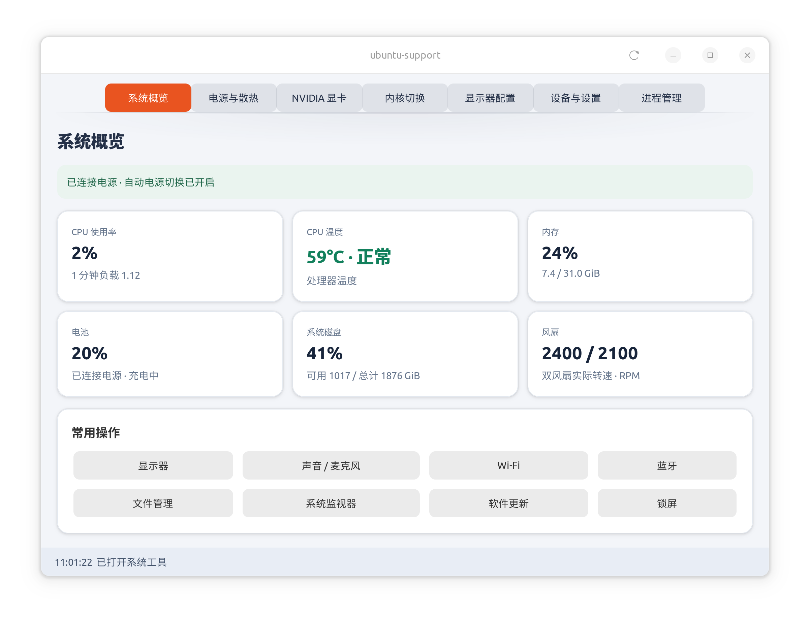
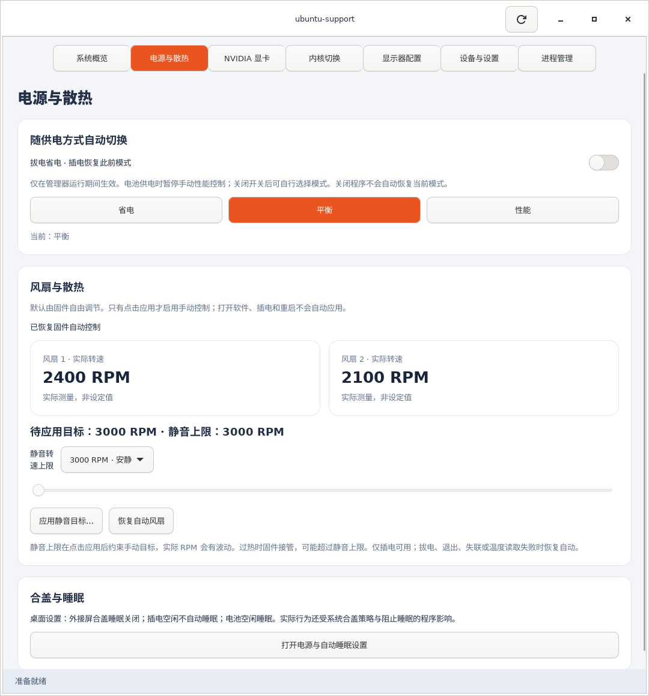
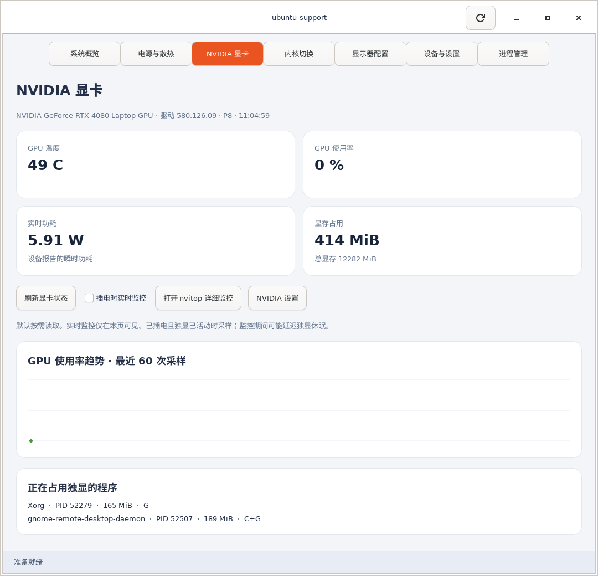
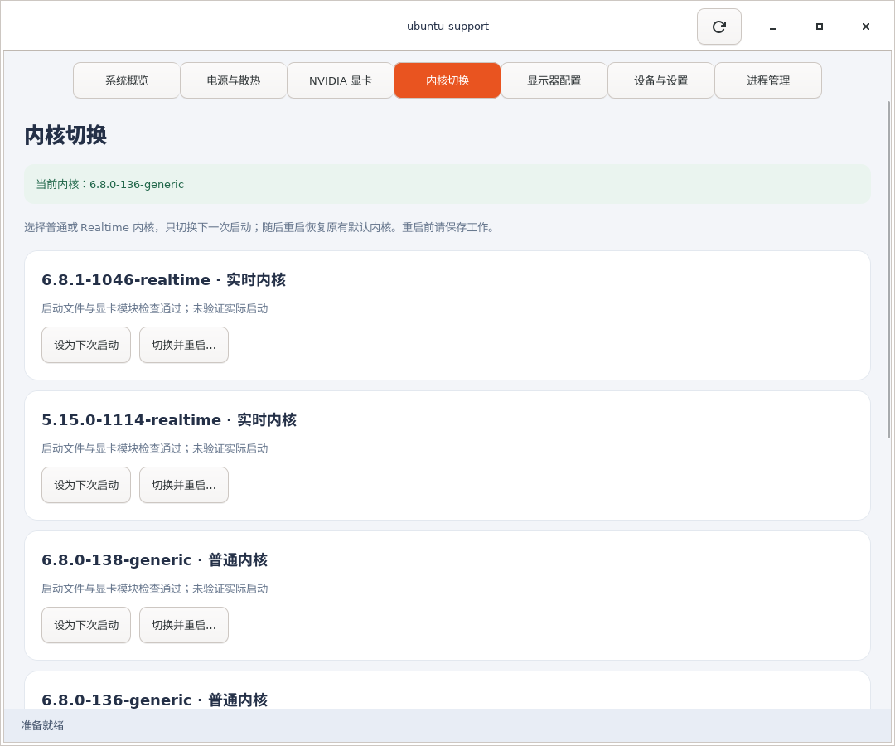
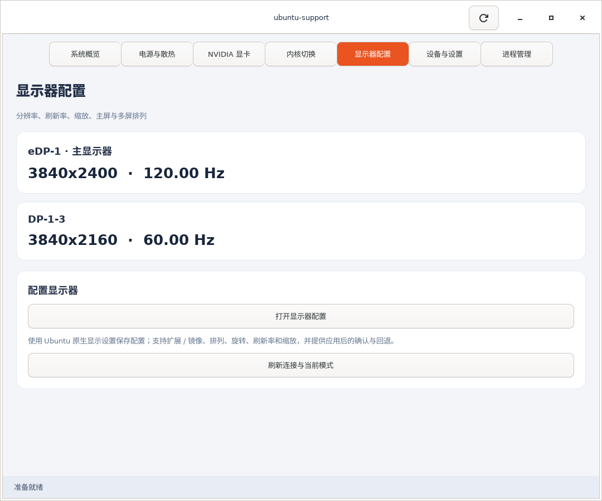
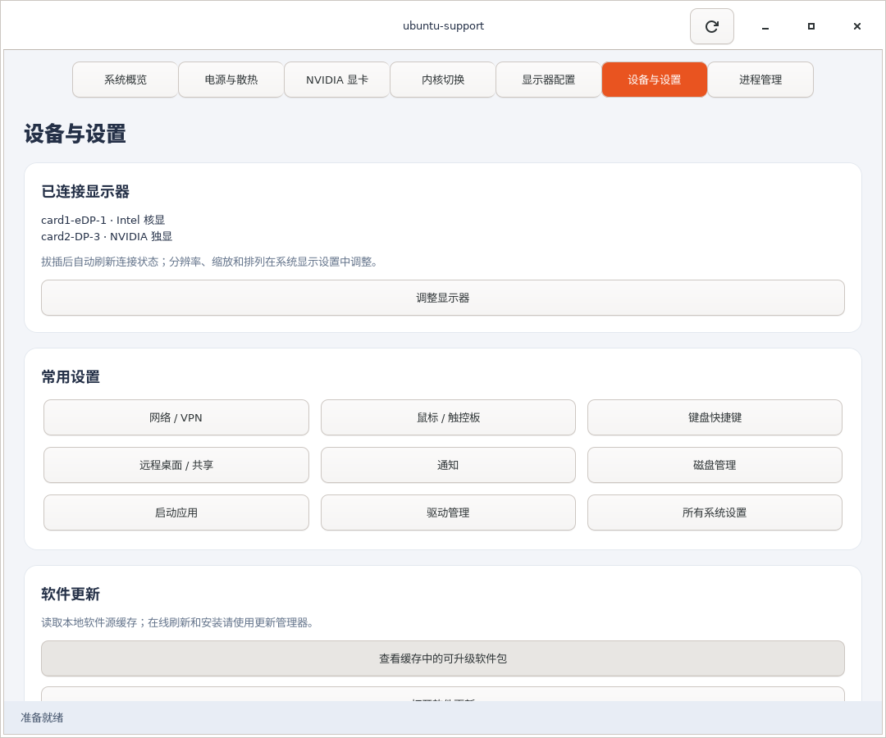
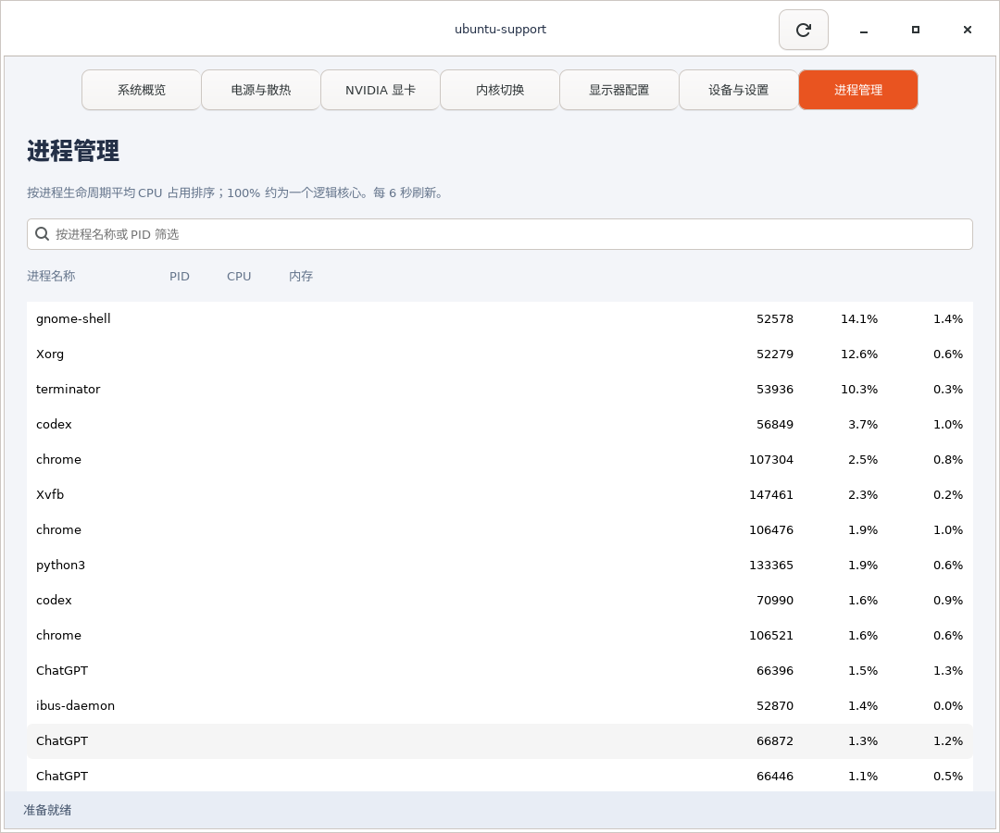

# ubuntu-support

**这是针对搭载 NVIDIA 独显的 Razer 笔记本开展的 Ubuntu 调试与支持项目（Razer laptop with NVIDIA GPU）。**

包含中文桌面管理工具与硬件修复记录，集中管理系统状态、电源、Razer 双风扇、NVIDIA 显卡、显示器和已安装的普通 / Realtime 内核。当前硬件控制和修复结论以本机验证为准，其他品牌、Razer 型号或 GPU 配置尚未验证。

当前版本：**0.2.0**。开发与硬件验证环境：**Ubuntu 22.04.5 LTS、Razer Blade 16（2024，RZ09-0510）、RTX 4080 Laptop**。



## 安装与启动

从 [Releases](https://github.com/kingchou007/ubuntu-laptop-support/releases) 下载 `.deb`，或在源码目录自行构建：

```bash
./scripts/build-deb.sh
sudo apt install ./dist/ubuntu-support_0.2.0_all.deb
ubuntu-support
```

也可以从应用菜单打开 **ubuntu-support**。`apt` 会安装 Python 3、GTK4、Polkit 等依赖。界面以普通用户运行；安装包提供独立的风扇服务和内核切换授权组件。

源码运行：`./run.sh`。完整硬件功能需要先安装 `.deb`；源码运行不会自动安装后台服务。

## 功能与截图

### 系统概览

CPU 使用率 / 温度、内存、电池电量和充电状态、磁盘可用空间、双风扇实际转速。常用入口包含显示器、声音 / 麦克风、Wi-Fi、蓝牙、文件管理、系统监视器、更新和锁屏。

### 电源与散热



- 省电 / 平衡 / 性能模式；仅启用系统实际支持的模式。
- 管理器运行期间，拔电切换省电，插电恢复此前模式；可关闭自动切换。
- 双风扇真实测速值，来源是 Razer HID tachometer，**不是目标转速，也不是 NVIDIA 的风扇百分比**。
- **默认仅监测，风扇由固件自由调节；只有点击应用才接管。** 打开软件、插电或重启不会自动应用手动转速。
- **安静优先：默认手动目标与静音上限均为 3000 RPM**。可自行选择更高上限，最高 4800 RPM；首次应用需要管理员认证。
- 静音上限限制的是手动目标，实际 RPM 可能波动；温度保护接管后，固件可能突破静音上限。应用前仍是固件自动，不会因为打开管理器就把风扇拉高。
- 拔电、关闭管理器、控制会话失联约 20 秒，或 CPU ≥85°C / GPU ≥80°C 时，恢复固件自动调节。
- 风扇转速逐步到达目标；控制范围是本项目采取的保守范围，不代表硬件极限。

风扇控制目前只支持经本机核对的 **USB 1532:02b7**。其他设备显示不可用，不能只修改设备 ID 后直接操作。

### NVIDIA 显卡



温度、使用率、功耗、显存卡片，使用率趋势图和图形 / 计算进程列表。默认手动刷新；可启用“插电时实时监控”，仅在显卡页可见且独显已活动时采样。主动查询可能延迟独显休眠，因此不用持续轮询来判断独显是否已休眠。

“打开 nvitop 详细监控”在终端中启动已安装的 [nvitop](https://github.com/XuehaiPan/nvitop)，提供详细 GPU / 进程交互监控；退出按 `q`。支持自动寻找 `~/.local/bin/nvitop`。未安装时可使用 `pipx install nvitop`。nvitop 运行期间会持续读取独显，电池供电时请按需关闭。

“NVIDIA 设置”打开已安装的厂商工具。显卡页面不提供超频、降压或未经验证的功率修改。

### 内核切换

**用途备注：** 内核切换主要服务于机器人控制场景：日常使用普通内核，在需要 Realtime 内核的机器人实时控制任务开始前，快速切换到已安装的实时内核。该功能负责内核选择与重启切换，机器人控制栈的实时配置和实际控制性能仍需按具体任务验证。



- 从本机 GRUB 读取普通和 Realtime 内核，不猜测菜单序号。
- 校验内核、initrd、模块目录；NVIDIA 机器额外检查对应的驱动模块。
- **设为下次启动**：完成认证后安排一次性切换，不立即重启。
- **切换并重启**：先显示目标版本和重启确认，再请求管理员认证。
- **取消下次切换**：清除一次性选择，保留原默认内核。

使用 `grub-reboot`，不会改写原默认内核。本版本限制在可验证的一次性启动环境；实际启动与驱动兼容性仍需重启验证。缺失启动文件或 NVIDIA 模块的版本显示原因并禁用切换。

### 显示器配置



查看接口、主屏、当前分辨率与刷新率；进入 Ubuntu 原生显示设置调整扩展 / 镜像、屏幕排列、旋转、缩放和刷新率。实际配置保存、应用确认与回退由 GNOME 处理。X11 下直接读取当前模式；Wayland 下以系统显示设置为准。

### 设备与设置、进程管理



网络 / VPN、输入设备、快捷键、共享 / 远程桌面、通知、磁盘、启动应用、驱动与更新入口。更新数量来自本地缓存，在线刷新和安装通过系统更新管理器进行。



支持按名称 / PID 筛选，显示 CPU 和内存占用；结束进程需确认，仅发送 SIGTERM。CPU 数字是 `ps` 报告的进程生命周期平均占用，100% 约等于一个逻辑核心。

## Razer 扬声器修复记录

[完整记录：Realtek ALC298 内置扬声器修复](docs/razer-speakers.md)

记录实际使用的上游 HDA 初始化序列、校验和、声卡动态识别、开机与唤醒服务，以及 2026-09-21 增加的声卡就绪等待。GUI 安装包不会重新执行或覆盖已有音频修复。

## 维护与验证

```bash
python3 -m unittest discover -v
python3 -m compileall -q ubuntu_support
./scripts/build-deb.sh
```

- [维护与发布流程](CONTRIBUTING.md)
- [架构、权限和回退](docs/architecture.md)
- [硬件验证记录与待测项目](docs/validation.md)
- [版本记录](CHANGELOG.md)
- [第三方协议来源](THIRD_PARTY.md)

主界面截图由用户提供；其余截图来自实际 GTK 程序在隔离 X11 桌面的渲染，硬件信息来自当时的本机采集。截图未包含账户信息或其他应用内容。

## 卸载

```bash
sudo apt remove ubuntu-support
```

卸载停止风扇服务并尝试恢复固件自动控制；不会移除系统内核或扬声器修复。已安排的下次内核切换应在卸载前用“取消下次切换”清除。

## 许可证

GPL-2.0-only，见 [LICENSE](LICENSE)。本项目为社区工具，与 Canonical、Razer、NVIDIA 无隶属关系。
